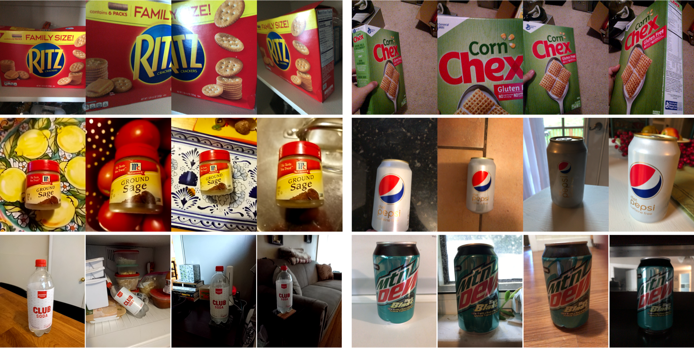
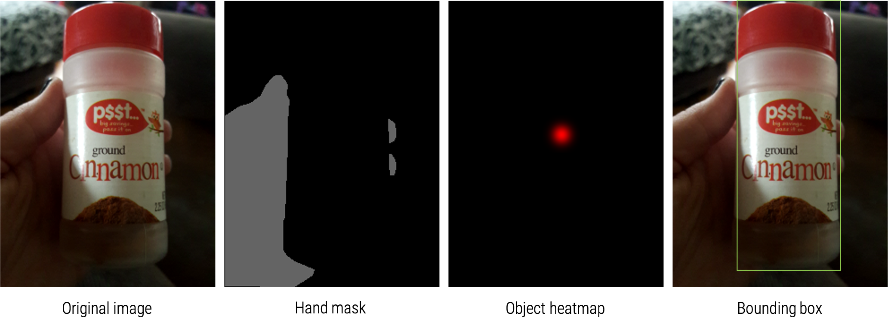

# CrowdTeaMa: Crowdsourcing for Teachable Machines Dataset

## Introduction

As teachable machines allow non-experts to personalize a machine learning model with their training samples,
the performance of a personalized model is affected by the user's teaching strategy. 
Motivated by the need of understanding non-experts' strategies of machine teaching,
we introduce a new dataset with images collected from 100 crowdworkers who trained and tested 
an object recognition model with the images of personal objects taken in their environments.
The detailed procedure of creating this dataset is described in our CHI2020 paper titled
"Crowdsourcing the Perception of Machine Teaching" (see citation below).

## Dataset
You can download our full dataset [here]().
> add the link to the dataset file later

The images are collected through five steps.
The crowdworkers first tested a general object recognizer with their images (Test0). 
Then, they train (Train1) and test (Test1) the model. 
They repeated the training (Train2) and testing (Test2) again. 
 
- 1,500 test images (Test0)
- 9,000 training images (Train1)
- 1,500 test images (Test1)
- 9,000 training images (Train2)
- 1,500 test images (Test2)

### Collection Process
Each participant train and test an object recognizer with images of three objects in the following process.

1. Test0: Testing a general object recognizer with 5 images per object (15 images in total)
2. Train1: Training a teachable object recognizer with 30 images per object (90 images in total)
3. Test1: Testing the object recognizer in Train1 with 5 images per object (15 images in total)
4. Train2: Training a teachable object recognizer with 30 images per object (90 images in total)
5. Test2: Testing the object recognizer in Train2 with 5 images per object (15 images in total)

### Annotation Process
Images are manually annotated with bounding boxes of objects, hand masks, object center heatmaps, and object labels.

### Structure
Note that only the training set includes hand masks and object center annotation data.  In each environment folder, there are several folders, each of which contains images taken under a different condition.

The images and annotations are in the directories with the following structure:

- Images (original images)
    - Participant
        - Step (Test0, Test1, Test2, Train1, Train2)
            - Object (names of the three objects)

- Masks (hand masks)
    - Participant
        - Step (Test0, Test1, Test2, Train1, Train2)
            - Object (names of the three objects)

- Objects (object center heatmap)
    - Participant
        - Step (Test0, Test1, Test2, Train1, Train2)
            - Object (names of the three objects)

- README.txt (readme text)
> the README file should be added later

- boxes.json (the bounding boxes of objects in images) 

### JSON data structure
The boxes.json file has the coordinates of bounding boxes in the following format.

    {
      (participant):
      {
        (step):
        {
          (image filename): [{x1, y1}, {x2, y2}],
          ...
        },
        ...
      },
      ...
    }

## Citation
Please cite our corresponding paper if you find our dataset useful.  Following is the BibTex of our paper:

    @inproceedings{hong2020crowdsourcing,
		author = {Hong, Jonggi and Lee, Kyungjun and Xu, June and Kacorri, Hernisa},
		title = {Crowdsourcing the Perception of Machine Teaching},
		year = {2020},
		isbn = {9781450367080},
		publisher = {Association for Computing Machinery},
		address = {New York, NY, USA},
		url = {https://doi.org/10.1145/3313831.3376428},
		doi = {10.1145/3313831.3376428},
		booktitle = {Proceedings of the 2020 CHI Conference on Human Factors in Computing Systems},
		pages = {1–14},
		numpages = {14},
		keywords = {object recognition, interactive machine learning, personalization, teachable interfaces, crowdsourcing},
		location = {Honolulu, HI, USA},
		series = {CHI '20}
	}

## License
This dataset is licensed under a [Creative Commons Attribution 4.0 International (CC BY 4.0) License](https://creativecommons.org/licenses/by/4.0/).

## Funding
This work is supported by NSF (#1816380). 

## Our results on TEgO
Following is the performance of our hand-guided object recognition system on TEgO.  It shows the average recall per object in two different environments (vanilla and wild).  The results were generated with our hand-guided object recognizer that was trained with images cropped by our object localization model.

## Contact
If you have any questions, please contact Jonggi Hong ([jhong12@umd.edu](jhong12@umd.edu)).

> Need to change the following information in the script

> sameAs, identifier, keyword

